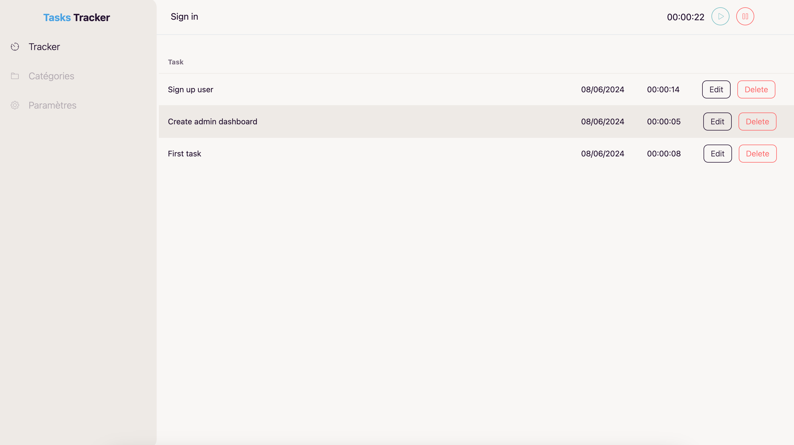

# Tasks Tracker

A simple Vuejs app using Vite for track tasks.

The goal is to develop an application like <a href="https://app.clockify.me">Clockify</a> but completely free and open source.

<p>
  
</p>

Actually we use <a href="https://jsonbin.io">JSONBin</a> for save all tasks !

## Installation

This project use <a href="https://vuejs.org/">Vue 3</a>  with <a href="https://vitejs.dev/">Vite</a>.

* Clone or Fork
```bash
git clone https://github.com/bolenge/tasks-tracker.git
```

* Installation packages
```bash
npm install
```

* Run dev server
```bash
npm run dev
```

* Run preview
```bash
npm run dev
```

* Build for production
```bash
npm run dev
```
